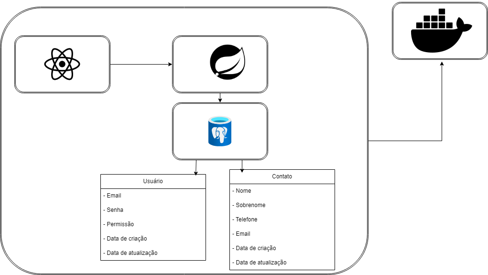

# Visão geral

*Objetivo:* API para cadastro de contatos com autenticação via JWT e interface para o usuário.

*Tecnologias utilizadas:*
- Backend: Java, Spring boot(JPA, Spring security, Spring web, Lombok, Mapstruct, JWT), Gradle, PostgrSQL.
- Frontend: NextJs, Anti design e Typescript.
- Infraestrutura: Docker

## Documentação Backend

*Arquitetura do projeto*: Foi utilizado uma arquitetura limpa visando sempre proteger o core da aplicação livrando o mesmo de libs externas ou algum acoplamento com algum tipo de framework. Utilizando bons padrões da próprio Java.

*Banco de dados:* No banco de dados a modelagem de dados foi feita seguindo o ACID, então a modelagem de dados foi bastante importante na hora de criação das tabelas.

*API:* Abaixo está todos os endpoints:

Contatos
```http
  GET /api/v1/contato/list
  Authorization: Bearer {token}
```
```http
  GET /api/v1/contato/{id}
  Authorization: Bearer {token}
```
```http
  GET /api/v1/contato/pager?page={numero}&size={tamanho}
  Authorization: Bearer {token}
```
```http
  POST /api/v1/contato/create
  Authorization: Bearer {token}
```
```http
  PUT /api/v1/contato/update/{id}
  Authorization: Bearer {token}
```
```http
  DELETE /api/v1/contato/delete/{id}
  Authorization: Bearer {token}
```

Usuários
```http
  GET /api/v1/usuario/list
  Authorization: Bearer {token}
```
```http
  GET /api/v1/usuario/{id}
  Authorization: Bearer {token}
```
```http
  POST /api/v1/usuario/create
```
```http
  PUT /api/v1/usuario/update/{id}
  Authorization: Bearer {token}
```
```http
  DELETE /api/v1/usuario/delete/{id}
  Authorization: Bearer {token}
```

Autenticação
```http
  POST /api/v1/auth/login
```

*Autenticação e autorização:* Foi utilizado o Spring Security junto com o JWT para que o usuário possa se autenticar na aplicação.

## Documentação Frontend
*Arquitetura do projeto:* Foi utilizado uma estrutura que a comunidade do NextJs utiliza muito quando temos alguma rota na página, hooks personalizados, chamadas a API e componentes personalizados.

*Componentes:* Nesse projeto utilizei a biblioteca para a geração de componentes Anti design.

*Consumo de API*: Utilizei o Axios para fazer chamadas a API. Decidi utilizar o Axios pela questão de simplicidade para poder fazer as requisições configurar headers para autorização e etc.

*Autenticação e autorização:* Na tela de login quando o usuário conseguir se autenticar o token é colocado automaticamente no local storage para que nas próximas requisições ele esteja autorizado a fazer as chamadas a API.

*Fluxo de navegação:* Ao entrar na tela inicial temos uma tela de login/registro para se caso o usuário não estiver cadastrado no sistema. Basta colocar o e-mail e senha para que possa se registrar e depois é só utilizar o mesmo para se autenticar. Logo após fazer o login você será redirecionado para a página principal na qual contém uma tabela com os dados dos contatos adicionados no sistema. Nessa mesma tela você vai poder filtrar por nome e email do contato.

## Infraestrutura

*Desenvolvimento/Deploy:* Utilizei o Docker para empacotamento do backend e para subir o banco de dados PostgreSQL.

## Modelagem do sistema

